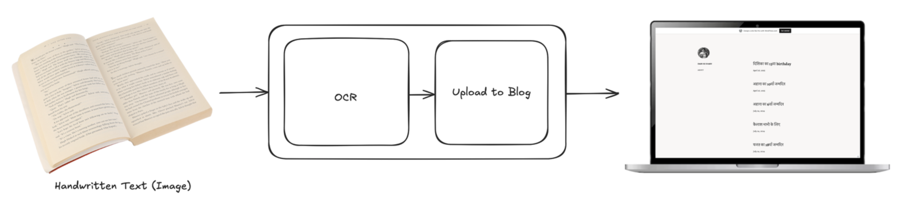

# Dadi Ki Diary


Dadi Ki Diary is a simple initiative to help digitise my grandmother's writings. Currently, it's a Python script that uses Azure Computer Vision to process images and publish the extracted text to WordPress.

I've open sourced the code here, in case you want to use it or build on top of it, some ideas I think would be pretty cool are:
- WhatsApp/Telegram bot interface for uploading blogs
- Server for everyone to use the service readily etc.
- and you can even create an MCP server for these endpoints and create an agent for this.

## Setup

### Prerequisites

#### 1. OCR Service Setup
I personally found Azure Computer Vision to be the best OCR service for this use case (Hindi handwritten text). To see if it works for your use case you can try it out here: [Azure Computer Vision Demo](https://portal.vision.cognitive.azure.com/demo/extract-text-from-images)

To set up Azure Computer Vision:
1. Go to [Azure Portal](https://portal.azure.com/)
2. Create a new resource of type "Computer Vision"
3. Get the endpoint and key from the resource

#### 2. WordPress Setup
Wordpress is pretty much the standard blog service, and the API access is pretty decent. If you do find a better blog service, create a PR, happy to add it.
1. Create a site at [WordPress.com](https://wordpress.com/)
2. Create a WordPress App at [developer.wordpress.com/apps/new](https://developer.wordpress.com/apps/new/)
   - For website URL, you can use your GitHub URL
   - Set a redirect URL (must match what you'll use in your code)
   - Select "Web Client" and create the app
   - Save your client ID and client secret
3. Set environment variables:
```bash
export WORDPRESS_CLIENT_ID="<your_wordpress_client_id>"
export WORDPRESS_CLIENT_SECRET="<your_wordpress_client_secret>"
export WORDPRESS_REDIRECT_URI="<your_wordpress_redirect_uri>"
```
4. Get your access token by following instructions in [wordpress_utils.py](./src/utils/wordpress_utils.py) by running:
```bash
python src/utils/wordpress_utils.py
```

### Installation

1. Create a virtual environment:
```bash
python -m venv venv
source venv/bin/activate  # On Windows use `venv\Scripts\activate`
```

2. Install dependencies:
```bash
pip3 install -r requirements.txt
```

3. Set environment variables:
```bash
export VISION_ENDPOINT="<your_vision_endpoint>"
export VISION_KEY="<your_vision_key>"
```

### Usage
Run the script:
```bash
python src/main.py
```

### How It Works
- Images from the `images` directory are processed
- Extracted text is saved to the `output` directory
- Text is processed and formatted
- Content is published to WordPress
- Processed images are moved to the `processed` directory
